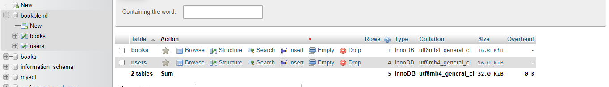

## BookBland


Sebuah sistem informasi web untuk menyimpan dan melihat favorite buku dari berbagai macam orang,
juga sebagai sarana penyelesaian tugas UAS Mata Kuliah Pemrograman Web RA

Nama    : Arsyadana Estu Aziz
NIM     : 121140068
Kelas   : RA

### Bagian 1 : Client-side Programming
Pada bagian ini, saya menggunakan konsep Javascript sebagai validator sebelum memasukan data user ke dalam database, hal ini dapat dilihat pada implementasi Login dan Register saya, dimana terdapat 2 file Javascript untuk melakukan handle pada form dan untuk validasi tersebut.
```js
// public/js/login.js
function validateLoginForm() {
    let userName = document.getElementById("username").value;
    let userPassword = document.getElementById("password").value;

    if (userInput.trim() === "" || userPassword.trim() === "") {
        alert("Please Provide a correct")
        return false;
    }

    return true;
}
```
```js
// public/js/register.js
function validateRegisterForm() {
    let userName = document.getElementById('username').value;
    let userEmail = document.getElementById('email').value;
    let userPassword = document.getElementById('password').value;

    if(userName.trim() === '' || userEmail.trim() === '' || userPassword.trim() === '') {
        alert('Please fill in all fields.');
        return false;
    }

    if(!userEmail.includes('@')) {
        alert('Please enter a valid email address.');
        return false;
    }

    return true;
}
```

### Bagian 2 : Server-side Programming
Pada bagian ini, kami cukup banyak melakukan metode POST dan GET dalam kasus ini, terutama ketika melakukan proses login dan register serta ketika melakukan proses CRUD (Create, Read, Update, dan Delete) pada Buku. Disini saya akan memberikan beberapa implementasi dari penggunaan GET dan POST ini dalam pengelolaan data dari formulir.
```php
// config/helper/registerUser.php
if ($_SERVER["REQUEST_METHOD"] == "POST") {
    $username = $_POST['username'];
    $email = $_POST['email'];
    $password = $_POST['password'];

    // Hash the password
    $hashed_password = password_hash($password, PASSWORD_DEFAULT);

    try {
        // Prepare SQL statement to insert user data
        $stmt = $conn->prepare("INSERT INTO users (username, email, password) VALUES (:username, :email, :password)");
        
        // Bind parameters
        $stmt->bindParam(':username', $username);
        $stmt->bindParam(':email', $email);
        $stmt->bindParam(':password', $hashed_password);
        
        // Execute the statement
        $stmt->execute();

        // Redirect to login page or display a success message
        header("Location: ../../views/login.php");
    }
    ...
}
```
```php
// config/helper/createBook.php
if ($_SERVER['REQUEST_METHOD'] == 'POST') {
    $nameBook = $_POST['name'];
    $isbnBook = $_POST['isbn'];
    $publisherBook = $_POST['publisher'];
    $genreBook = $_POST["genre"];

    try {
        // Prepare an insert statement
        $statement = $conn->prepare("INSERT INTO books (title, ISBN, publisher, genre)
        VALUES (:title, :isbn, :publisher, :genre)");
        
        // Bind parameters
        $statement->bindParam(':title', $nameBook);
        $statement->bindParam(':isbn', $isbnBook);
        $statement->bindParam(':publisher', $publisherBook);
        $statement->bindParam(':genre', $genreBook);
        
        // Execute the statement
        $statement->execute();

        // Redirect to book list or display a success message
        header("Location: ../../views/listBook.php"); // Adjust the redirection as necessary
        exit();
    }
    ...
}
```

### Bagian 3 : Database Management
Disini saya menggunakan `connection.php` sebagai sarana untuk membuat dan menghubungkan database beserta table jika memang belum dibuat.
```php
// config/connection.php
// Menyimpan host, username, password, dan port pada sebuah variable
<?php
$host = 'localhost';
$username = 'root';
$password = '';
$port = 3307; # Default using 3306, but since the port 3306 is used for something else,I set up the port to 3307
```
```php
// config/connection.php

/*
* Membuat database dan table jika belum dibuat melalui sintax php, disini saya membuat database baru * * bernama BookBlend dengan dua tabel data yang bernama books dan users dengan atributnya masing-masing.
*/
try {
    $conn = new PDO("mysql:host=$host; port=$port;", $username, $password);
    
    $conn->setAttribute(PDO::ATTR_ERRMODE, PDO::ERRMODE_EXCEPTION);

    // Database name to be created
    $dbname = 'BookBlend';

    // Create the database if doesn't exist
    $conn->exec("CREATE DATABASE IF NOT EXISTS $dbname");

    // Switch to the newly created or existed database
    $conn->exec("USE $dbname");

    // Define the books table schema
    $bookTableQuary = "
        CREATE TABLE IF NOT EXISTS books (
            id INT(11) PRIMARY KEY AUTO_INCREMENT,
            title VARCHAR(255) NOT NULL,
            ISBN VARCHAR(13) NOT NULL,
            publisher VARCHAR(255) NOT NULL,
            genre VARCHAR(255) NOT NULL
        )
    ";

    $conn->exec($bookTableQuary);

    $userTableQuery = "
    CREATE TABLE IF NOT EXISTS users (
        id INT(11) AUTO_INCREMENT PRIMARY KEY,
        username VARCHAR(255) NOT NULL,
        email VARCHAR(255) NOT NULL,
        password VARCHAR(255) NOT NULL
        )
    ";

    $conn->exec($userTableQuery);

} catch(PDOException $e) {
    echo "Connection error: " . $e->getMessage();
}
```

Hal ini memungkinkan kita untuk melakukan konfigurasi database secara dinamis tanpa menyentuh PhpMyAdmin contohnya untuk melakukan pembuatan database.

### Bagian 4 : State Management
Disini juga saya mengimpelemtasikan Session untuk menyimpan status login dari para pengguna, jadi ketika para user Login, maka status tersebut dapat disimpan dalam Session sehingga kapan pun para pengguna balik, pengguna tidak perlu untuk login ulang lagi.
```php
// config/helper/loginUser.php
/*
* Disini saya melakukan konfigurasi session ketika para user Login
*/
if ($user && password_verify($password, $user['password'])) {
    // Password is correct, start a new session and redirect to a secure page
    session_start();
    $_SESSION['username'] = $user['username'];
    header("Location: ../../views/listBook.php"); // Redirect to a secure page
    exit();
```
```php
// index.php
/*
* Disini saya bisa melakukan cek pada halaman landing page jika user pernah login atau tidak sehingga dapat diarahkan langsung ke website utama 
*/
<?php
/**
 * Start a session and check if the user has the session,
 * then redirect to the list books
 */
session_start();

if (isset($_SESSION['username'])) {
    header("Location: views/listBook.php"); // Redirect to your book list page
    exit();
}
?>
```
```php
// views/createBook.php
/*
* Hal sebaliknya, jika user belum login dan mencoba mengakses bagian web yang lain seperti membuat buku baru maka akan diarahkan ke dalam index untuk user agar bisa login terlebih dahulu
*/
<?php
    session_start();

    // Check if the user is not logged in, redirect to login page
    if (!isset($_SESSION['username'])) {
      header("Location: ../index.php"); // Redirect to your login page
      exit();
    }
?>
```
